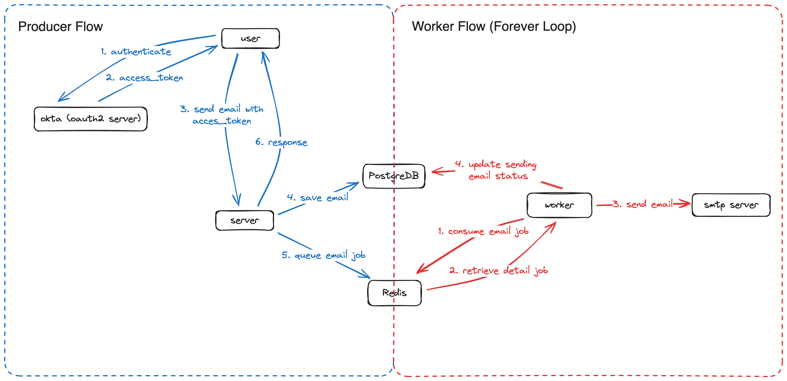
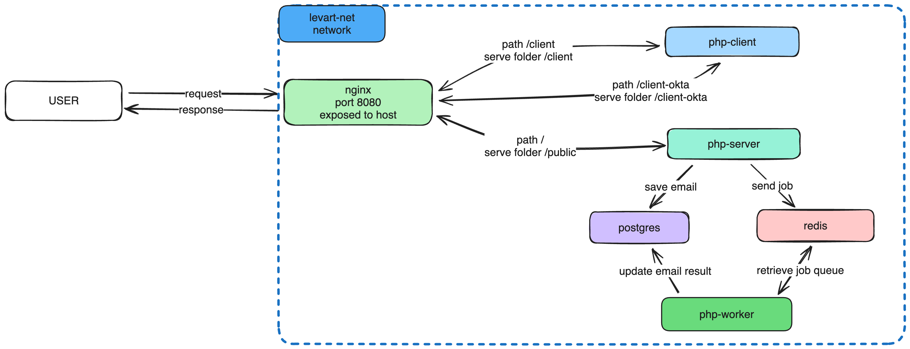

## Email Sender Project
This service main functionality is to send email asynchronously using worker. The detail information about this service is listed below:
- Language: `PHP8.3`
- Dependency Management: `composer`
- Database: `PostgreSQL`
- Protocol: `HTTP`
- Queue: `Redis`
- Oauth2 Provider: `Okta` https://www.okta.com/

### System Design
1. Flow process
 

2. Docker design
 

### Database migration
#### Run Manual
Run `.sql` script manually one by one with ordering by prefix e.g 000001_, 000001_, etc

or

#### Using `migrate` CLI
1. Installation [source](https://github.com/golang-migrate/migrate)
    - WINDOWS:
        ```
        scoop install migrate
        ```
    - MAC: 
        ```
        brew install golang-migrate
        ```
    - LINUX: 
        ```
        $ curl -L https://packagecloud.io/golang-migrate/migrate/gpgkey| apt-key add -
        $ echo "deb https://packagecloud.io/golang-migrate/migrate/ubuntu/ $(lsb_release -sc) main" > /etc/apt/sources.list.d/migrate.list
        $ apt-get update
        $ apt-get install -y migrate
        ```
    please visit https://www.freecodecamp.org/news/database-migration-golang-migrate for detail instruction
2. Add database config into `.env` file. Ensure following variables exist and don't forget to fill the value:
    ```
    DB_HOST=
    DB_PORT=
    DB_DATABASE=
    DB_USERNAME=
    DB_PASSWORD=
    ```
3. Execute Migration
    - Up: `make migrate-up`
    - Down: `make migrate-down`

### API Reference

#### Register

```http
  POST /register
```

| Parameter | Type     | Description                       |
| :-------- | :------- | :-------------------------------- |
| `email`      | `string` | **Required**. user email|
| `password`      | `string` | **Required**. user password|

#### Login

```http
  POST /login
```

| Parameter | Type     | Description                       |
| :-------- | :------- | :-------------------------------- |
| `email`      | `string` | **Required**. user email|
| `password`      | `string` | **Required**. user password|

#### Get token for testing
```http
  GET /client
```

#### Get token for okta client
```http
  GET /client-okta
```

#### Send email

```http
  POST /email
```
header `Authorization: Bearer {{access_token}}`

| Parameter | Type     | Description                       |
| :-------- | :------- | :-------------------------------- |
| `is_html`      | `boolean` | **Optional**. default value false|
| `email_to`      | `string` | **Required**. Target email to whom the email will be sent|
| `subject`      | `string` | **Required**. Email subject|
| `body`      | `string` | **Required**. Email body that can be in HTML format by setting `is_html` to `true`|

example
```json
{
    "is_html": "true",
    "email_to": "user@user.com",
    "subject": "testing subject",
    "body": "<br>Hello World<br>"
}
```

### How to run
#### Prerequisite
1. Install `docker` alongside `compose` plugin https://docs.docker.com/compose/install/

#### Steps
1. Create `.env` and fill it with correct value. Refer to `.env.example`
2. Build image `php:base-image`
    ```bash
    docker build -t php:base-image .
    ```
3. Run docker compose
    ```bash
    docker-compose up -d
    ```
4. Execute database migration [here](#database-migration)
5. Open client page in your browser to get bearer token
    5.1 Visit http://localhost:8080/client for testing client, or
    5.2 Visit http://localhost:8080/client-okta if using okta user
6. Copy bearer token `Bearer {{ token }}`
7. Execute this example curl in your Postman or terminal. Don't forget to change the token value with the one from step 6
    ```bash
    curl -L 'http://localhost:8080/email' \
    -H 'Authorization: Bearer {{ token }}' \
    -H 'Content-Type: application/json' \
    --data-raw '{
        "is_html": "true",
        "email_to": "user@levart.com",
        "subject": "testing subject final",
        "body": "<br>Hello World! Nice to meet you<br>"
    }'
    ```
